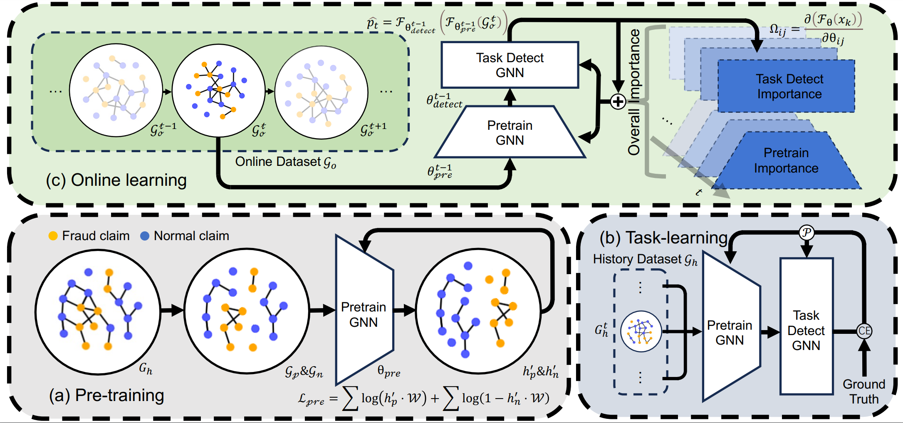

# Pre-trained Online Contrastive Learning for Insurance Fraud Detection



## Usage
### Setup your env
Run the following command to set up the environment:
```
conda env create -f environment.yaml
```
### Preprocess the data

Run the following command to prepare for the data.
```
conda activate pygvenv
python preprocess.py
```

### Run the code

Run the following command to run POCL
```
python main.py
```

## Project Structure
* ```main.py```: The file that contains the training process of POCL will input the results of the entire process and plot the images.
* ```preprocess.py```: The file contains code for modeling a healthcare insurance dataset from tabular data into a temporal graph data structure.
* ```models.py```: The file contains the main model code for POCL.
* ```tools.py```: The file contains some helper functions.

## Citing
If you find POCL is useful for your research, please consider citing the following papers:

```
@article{POCL, 
    title={Pre-trained Online Contrastive Learning for Insurance Fraud Detection}, 
    volume={38}, 
    url={https://ojs.aaai.org/index.php/AAAI/article/view/30259},
    DOI={10.1609/aaai.v38i20.30259}, 
    number={20}, 
    journal={Proceedings of the AAAI Conference on Artificial Intelligence}, 
    author={Zhang, Rui and Cheng, Dawei and Yang, Jie and Ouyang, Yi and Wu, Xian and Zheng, Yefeng and Jiang, Changjun}, 
    year={2024}, 
    month={Mar.}, 
    pages={22511-22519} 
}
```